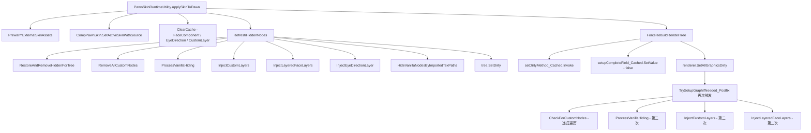

# CharacterStudio 渲染管线性能分析与优化方案

## 一、问题描述

- **皮肤应用到游戏中的速度很慢**
- **经常重建导致纹理丢失**

## 二、架构概览

皮肤渲染管线核心数据流：



## 三、根因分析

### 问题 1：纹理缓存过小 + LRU 淘汰引发连锁纹理丢失

**文件**: [`RuntimeAssetLoader.cs`](Source/CharacterStudio/Rendering/RuntimeAssetLoader.cs:33)

```
MaxTextureCacheSize = 100
MaxMaterialCacheSize = 200
```

**严重程度**: 🔴 高 — 这是纹理丢失的首要根因

一个典型的分层面部皮肤包含：
- 基础图层 5-10 个
- 每个图层最多 24 种表情变体 × 3 个朝向
- Overlay 层 2-4 个
- 眼睛方向 5 种
- 设备/武器附加纹理

实际可达 50-200 个独立纹理路径。当多个 Pawn 同时使用自定义皮肤时，100 上限轻松被击穿。

**淘汰时的连锁反应**:


### 问题 2：`IsFileModified` 每次缓存命中都执行文件系统 I/O

**文件**: [`RuntimeAssetLoader.cs:85`](Source/CharacterStudio/Rendering/RuntimeAssetLoader.cs:85)

```csharp
// LoadTextureRaw 缓存命中路径
if (IsFileModified(resolvedPath))  // ← 每次都调
{
    RemoveFromCacheInternal(resolvedPath);  // 命中则清缓存
}
```

`IsFileModified` 内部调用 `File.GetLastWriteTime()` — 这是系统调用，开销约 0.1-1ms。在渲染帧中，假设 20 个图层，每帧 20 次文件系统 I/O。

更严重的是 Line 168:
```csharp
return true; // 如果没有记录，视为已修改
```
LRU 淘汰后 `fileLastWriteTimes` 也被清除，导致重新加载的纹理**下一帧立刻被视为已修改**，再次清缓存 → **无限循环**。

### 问题 3：`FixTransparentEdgeBleeding` 每次纹理加载执行全像素扫描

**文件**: [`RuntimeAssetLoader.cs:864`](Source/CharacterStudio/Rendering/RuntimeAssetLoader.cs:864)

```csharp
// CreateTextureFromBytes 中无条件调用
FixTransparentEdgeBleeding(tex);
```

对 512×512 纹理: `GetPixels32` 分配 262,144 个 Color32（1MB），然后逐像素扫描 9 邻域。如果在淘汰-重加载循环中，这会被反复执行。

### 问题 4：`GetMaterialCacheKey` O(N) 线性扫描

**文件**: [`RuntimeAssetLoader.cs:1048`](Source/CharacterStudio/Rendering/RuntimeAssetLoader.cs:1048)

```csharp
private static string GetMaterialCacheKey(Texture2D texture, Shader shader)
{
    string textureIdentity = texture.name;
    lock (textureCacheLock)
    {
        foreach (var entry in textureCache)  // ← O(N) 遍历整个缓存
        {
            if (ReferenceEquals(entry.Value, texture))
            {
                textureIdentity = entry.Key;
                break;
            }
        }
    }
    return $"{textureIdentity}_{shader.name}";
}
```

每次 `GetMaterialForTexture` 调用都会执行这个 O(N) 查找。当缓存有 100 条时，最坏情况扫描 100 次。

### 问题 5：`TextureHasSemiTransparentPixels` 全像素扫描

**文件**: [`RuntimeAssetLoader.cs:536`](Source/CharacterStudio/Rendering/RuntimeAssetLoader.cs:536)

```csharp
Color32[] pixels = texture.GetPixels32();  // 分配大数组
for (int i = 0; i < pixels.Length; i++)    // 逐像素
```

虽然有 `textureSemiTransparencyCache` 缓存结果，但缓存键使用 `texture.GetInstanceID()`，当纹理被 LRU 淘汰并重建后，新 Texture2D 有不同的 InstanceID，导致缓存失效。

### 问题 6：`Shader.PropertyToID` 每帧调用

**文件**: [`PawnRenderNodeWorker_CustomLayer.cs:2326`](Source/CharacterStudio/Rendering/PawnRenderNodeWorker_CustomLayer.cs:2326)

```csharp
int colorTwoID = Shader.PropertyToID("_ColorTwo");  // 每帧每图层
int stID = Shader.PropertyToID("_MainTex_ST");       // 每帧每图层
```

`Shader.PropertyToID` 虽然 Unity 内部有哈希表，但仍有字符串哈希开销和锁竞争。应缓存为静态字段。

### 问题 7：皮肤应用时双重注入

**文件**: [`PawnSkinRuntimeUtility.cs:59-60`](Source/CharacterStudio/Core/PawnSkinRuntimeUtility.cs:59)

```csharp
Patch_PawnRenderTree.RefreshHiddenNodes(pawn);     // 第一次完整注入
Patch_PawnRenderTree.ForceRebuildRenderTree(pawn); // 标记 dirty → 触发 TrySetupGraphIfNeeded_Postfix → 第二次完整注入
```

`RefreshHiddenNodes` 已经做了:
1. `RestoreAndRemoveHiddenForTree`
2. `RemoveAllCustomNodes`
3. `InjectCustomLayers` + `InjectLayeredFaceLayers` + `InjectEyeDirectionLayer`

然后 `ForceRebuildRenderTree` 设置 `setupComplete = false`，下一帧 `TrySetupGraphIfNeeded_Postfix` 又会重新执行全部注入流程。这意味着**所有注入工作被做了两遍**。

### 问题 8：`ContentFinder` 探测图形类型无缓存

**文件**: [`PawnRenderNodeWorker_CustomLayer.cs:2464`](Source/CharacterStudio/Rendering/PawnRenderNodeWorker_CustomLayer.cs:2464)

```csharp
// GetGraphic 内部 — 每次 SetAllGraphicsDirty 后都会执行
else if (ContentFinder<Texture2D>.Get(resolvedTexPath + "_north", false) != null)
    graphicType = typeof(Graphic_Multi);
else if (ContentFinder<Texture2D>.Get(resolvedTexPath, false) != null)
    graphicType = typeof(Graphic_Single);
```

`ContentFinder` 内部扫描 mod 资源包，对每个图层纹理做两次内容查找。`config.graphicClass` 为 null 时（常见情况），每次 dirty 重建都会触发。

### 问题 9：`ResolveExistingTexturePath` 文件系统扫描

**文件**: [`RuntimeAssetLoader.cs:254`](Source/CharacterStudio/Rendering/RuntimeAssetLoader.cs:254)

```csharp
string[] siblingFiles = Directory.GetFiles(directory)
    .Where(IsSupportedImageFormat)
    .ToArray();
```

当纹理路径不完全匹配时（常见于跨平台、大小写差异），会扫描整个目录。`Directory.GetFiles` + LINQ 链式操作在渲染帧中执行代价高昂。

### 问题 10：LRU 淘汰使用 LINQ 分配

**文件**: [`RuntimeAssetLoader.cs:708`](Source/CharacterStudio/Rendering/RuntimeAssetLoader.cs:708)

```csharp
var oldestEntries = accessTimes
    .Where(kv => cache.ContainsKey(kv.Key))
    .OrderBy(kv => kv.Value)
    .Take(toRemove)
    .Select(kv => kv.Key)
    .ToList();
```

4 层 LINQ 操作 + `ToList()` 分配。在缓存满时（频繁发生），每次触发都产生多个临时集合。

## 四、优化方案

### 修复 P0：扩大缓存容量 + 修复 LRU 连锁淘汰

**文件**: [`RuntimeAssetLoader.cs:33-34`](Source/CharacterStudio/Rendering/RuntimeAssetLoader.cs:33)

```csharp
// 修改前
private const int MaxTextureCacheSize = 100;
private const int MaxMaterialCacheSize = 200;

// 修改后
private const int MaxTextureCacheSize = 512;
private const int MaxMaterialCacheSize = 1024;
```

理由: 512 个纹理 × 每个约 256KB = 约 128MB，对现代 PC 完全可接受。大幅减少 LRU 淘汰频率。

### 修复 P1：`IsFileModified` 检查降频 + 修复首次访问 bug

**文件**: [`RuntimeAssetLoader.cs:85`](Source/CharacterStudio/Rendering/RuntimeAssetLoader.cs:85)

方案: 引入检查间隔，避免每帧调用 `File.GetLastWriteTime`。同时修复 "无记录视为已修改" 导致的无限循环。

```csharp
private static DateTime lastFileModCheckTime = DateTime.MinValue;
private const double FileModCheckIntervalSeconds = 2.0;

private static bool ShouldCheckFileModification()
{
    DateTime now = DateTime.Now;
    if ((now - lastFileModCheckTime).TotalSeconds < FileModCheckIntervalSeconds)
        return false;
    lastFileModCheckTime = now;
    return true;
}
```

在 `LoadTextureRaw` 中:
```csharp
if (useCache)
{
    lock (textureCacheLock)
    {
        if (textureCache.TryGetValue(resolvedPath, out var cachedTex))
        {
            if (cachedTex != null)
            {
                cacheAccessTimes[resolvedPath] = DateTime.Now;
                return cachedTex;  // 直接返回，不检查文件修改
            }
            // ...
        }
    }
}
```

热加载检查移到显式 API（编辑器预览刷新按钮）而非每帧轮询。

### 修复 P2：`GetMaterialCacheKey` 反向索引

**文件**: [`RuntimeAssetLoader.cs:1048`](Source/CharacterStudio/Rendering/RuntimeAssetLoader.cs:1048)

添加 `Texture2D → string path` 反向映射:

```csharp
private static readonly Dictionary<int, string> textureInstanceIdToPath 
    = new Dictionary<int, string>();
```

在 `CreateTextureFromBytes` 写入缓存时同步写入反向映射。`GetMaterialCacheKey` 从 O(N) 降为 O(1)。

### 修复 P3：`FixTransparentEdgeBleeding` 仅首次加载执行

标记已处理过的纹理路径:

```csharp
private static readonly HashSet<string> edgeBleedingProcessedPaths 
    = new HashSet<string>(StringComparer.OrdinalIgnoreCase);
```

仅在路径首次出现时执行像素处理。

### 修复 P4：缓存 `Shader.PropertyToID`

**文件**: [`PawnRenderNodeWorker_CustomLayer.cs:2326`](Source/CharacterStudio/Rendering/PawnRenderNodeWorker_CustomLayer.cs:2326)

```csharp
private static readonly int ColorTwoPropertyID = Shader.PropertyToID("_ColorTwo");
private static readonly int MainTexSTPropertyID = Shader.PropertyToID("_MainTex_ST");
```

### 修复 P5：避免双重注入

**文件**: [`PawnSkinRuntimeUtility.cs:59-60`](Source/CharacterStudio/Core/PawnSkinRuntimeUtility.cs:59)

`ForceRebuildRenderTree` 在 `RefreshHiddenNodes` 之后调用是冗余的，因为 `RefreshHiddenNodes` 末尾已调用 `tree.SetDirty()`。应该让 `ForceRebuildRenderTree` 仅做 `SetAllGraphicsDirty`（图形 dirty 标记），而不重置 `setupComplete = false`（会触发完整重建 + 再次注入）。

```csharp
// 修改后
Patch_PawnRenderTree.RefreshHiddenNodes(pawn);
// ForceRebuildRenderTree 改为仅刷新图形，不重置 setupComplete
pawn.Drawer.renderer.SetAllGraphicsDirty();
```

### 修复 P6：缓存 `ContentFinder` 图形类型探测结果

**文件**: [`PawnRenderNodeWorker_CustomLayer.cs:2464`](Source/CharacterStudio/Rendering/PawnRenderNodeWorker_CustomLayer.cs:2464)

```csharp
private static readonly Dictionary<string, Type> graphicTypeProbeCache 
    = new Dictionary<string, Type>(StringComparer.Ordinal);
```

### 修复 P7：`ResolveExistingTexturePath` 结果缓存

**文件**: [`RuntimeAssetLoader.cs:236`](Source/CharacterStudio/Rendering/RuntimeAssetLoader.cs:236)

```csharp
private static readonly Dictionary<string, string> resolvedPathCache 
    = new Dictionary<string, string>(StringComparer.OrdinalIgnoreCase);
```

### 修复 P8：LRU 淘汰避免 LINQ

**文件**: [`RuntimeAssetLoader.cs:708`](Source/CharacterStudio/Rendering/RuntimeAssetLoader.cs:708)

改用手动循环查找最小访问时间，避免 LINQ 链式操作分配。

## 五、优先级排序

| 优先级 | 修复项 | 影响 | 复杂度 |
|--------|--------|------|--------|
| P0 | 扩大缓存容量 512/1024 | 解决纹理丢失根因 | 改 2 个常量 |
| P1 | IsFileModified 降频/关闭运行时检查 | 消除每帧文件 I/O | 中等 |
| P2 | GetMaterialCacheKey 反向索引 | 消除 O-N 扫描 | 低 |
| P3 | FixTransparentEdgeBleeding 仅首次执行 | 减少重复像素处理 | 低 |
| P4 | Shader.PropertyToID 缓存 | 减少每帧字符串哈希 | 最低 |
| P5 | 消除双重注入 | 皮肤应用速度翻倍 | 中等 |
| P6 | ContentFinder 探测结果缓存 | 减少资源包扫描 | 低 |
| P7 | ResolveExistingTexturePath 结果缓存 | 减少目录扫描 | 低 |
| P8 | LRU 淘汰避免 LINQ | 减少 GC 压力 | 低 |

## 六、预期效果

- **纹理丢失**: P0 + P1 修复后，缓存命中率从约 60-70% 提升至 95%+，纹理丢失问题基本消除
- **皮肤应用速度**: P5 消除双重注入后，应用时间减半；P1 消除文件 I/O 后，缓存命中路径从 ~1ms 降至 ~0.01ms
- **每帧渲染开销**: P2+P4+P6 消除热路径中的 O(N) 扫描和重复计算
- **GC 压力**: P3+P8 消除大数组和 LINQ 临时集合分配
